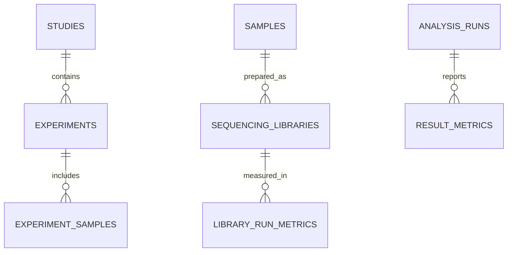

# Scientific Data Model

Lightweight PostgreSQL data model for organizing experimental metadata, sequencing outputs, and downstream analysis results into a consistent, queryable structure across studies and experiments.

## Purpose

This project demonstrates how scientific metadata and sequencing analysis outputs can be structured in a relational database for reproducible, SQL-based analysis. It models the relationships between studies, experiments, samples, sequencing libraries, sequencing runs, analysis workflows, files, and result metrics.

The goal is not to replace a full LIMS or scientific data management platform. Instead, this repository provides a focused relational schema demonstrating how experimental context, sequencing outputs, and downstream analytical results can be connected through stable identifiers for reproducible cross-experiment analysis.

## Current Scope

The current schema supports:

- Study and experiment organization
- Biological subject and sample metadata
- Experimental conditions and protocol tracking
- Sequencing library and run provenance
- File-level metadata and checksum tracking
- Analysis workflow versioning and parameter capture
- Cross-experiment SQL queries and validation checks

## Repository Layout

```text
.
|-- README.md
|-- LICENSE
|-- docs/
|   `-- erd.md
|-- sql/
|   |-- schema.sql
|   |-- seed_example.sql
|   |-- seed_synthetic_large.sql
|   |-- queries/
|   |   |-- cross_experiment_summary.sql
|   |   |-- sample_lineage.sql
|   |   `-- sequencing_qc.sql
|   `-- validation/
|       |-- analysis_provenance_checks.sql
|       |-- expected_demo_counts.sql
|       |-- sample_metadata_checks.sql
|       `-- sequencing_qc_checks.sql
`-- .gitignore
```

## Quick Start

Requirements:

- PostgreSQL server
- PostgreSQL command-line tools: `psql` and `createdb`
- A database role with permission to create databases and tables

Create a PostgreSQL database and load the schema:

```bash
createdb scientific_data_model
psql scientific_data_model -f sql/schema.sql
psql scientific_data_model -f sql/seed_example.sql
```

For a larger synthetic dataset with multiple studies, experiments, samples, sequencing runs, and result metrics, load:

```bash
psql scientific_data_model -f sql/seed_synthetic_large.sql
```

Run an example query:

```bash
psql scientific_data_model -f sql/queries/cross_experiment_summary.sql
```

Run validation checks:

```bash
psql scientific_data_model -f sql/validation/sample_metadata_checks.sql
psql scientific_data_model -f sql/validation/sequencing_qc_checks.sql
psql scientific_data_model -f sql/validation/analysis_provenance_checks.sql
psql scientific_data_model -f sql/validation/expected_demo_counts.sql
```

Validation queries return rows when a check finds records that need attention. Empty result sets mean no issues were found for that check.

## WSL/PostgreSQL Notes

If `createdb` or `psql` is missing on Ubuntu/WSL, install the PostgreSQL client tools:

```bash
sudo apt update
sudo apt install postgresql postgresql-client postgresql-client-common
```

Start PostgreSQL:

```bash
sudo service postgresql start
```

If PostgreSQL reports that your Linux user role does not exist, run commands as the default `postgres` role:

```bash
sudo -u postgres createdb scientific_data_model
sudo -u postgres psql scientific_data_model -f sql/schema.sql
```

If the demo database already exists and you want a clean reload:

```bash
sudo -u postgres dropdb --if-exists scientific_data_model
sudo -u postgres createdb scientific_data_model
sudo -u postgres psql scientific_data_model -f sql/schema.sql
sudo -u postgres psql scientific_data_model -f sql/seed_synthetic_large.sql
```

If `dropdb` reports that the database is being accessed by other users, terminate existing sessions from the maintenance database and rerun the clean reload commands:

```bash
sudo -u postgres psql -d postgres -c "
SELECT pg_terminate_backend(pid)
FROM pg_stat_activity
WHERE datname = 'scientific_data_model'
  AND pid <> pg_backend_pid();
"
```

## Model Highlights

- Experiments are grouped under studies.
- Samples can be connected to subjects, source material, protocols, and conditions.
- Sequencing libraries and runs are modeled separately so one library can be sequenced more than once.
- Files are first-class records with checksums, storage locations, formats, and provenance.
- Analysis runs capture workflow identity, version, parameters, inputs, outputs, and metrics.
- Validation queries flag missing metadata, incomplete sequencing QC, incomplete analysis provenance, and unexpected demo row counts.

## High-Level Entity Relationships


- [Complete Entity Relationship Diagram](docs/erd.md)

## Comparison To Existing Approaches

This project sits between ad hoc metadata files and full scientific data management systems:

- Compared with spreadsheets or CSV metadata sheets, the PostgreSQL schema provides stronger consistency, reusable joins, and clearer relationships between samples, sequencing runs, and analysis outputs.
- Compared with standards such as ISA-Tab or ISA-JSON, this project is less focused on metadata exchange and more focused on direct SQL querying and relational design.
- Compared with platforms such as LabKey Server or openBIS, this project is much smaller and does not include a user interface, permissions, audit trails, or workflow automation.
- Compared with analysis containers such as Bioconductor `MultiAssayExperiment`, this project is a persistent relational backend rather than an in-memory analysis object.

The intended use case is a lightweight scientific data engineering prototype: transparent enough to inspect in GitHub, structured enough to support cross-experiment queries, and small enough to adapt for new experimental metadata patterns.

## Example Questions Supported By The Schema

- Which RNA-seq libraries across all studies failed sequencing QC thresholds?
- Which samples were processed with a specific protocol version?
- Which analysis workflow and reference genome generated a given result file?
- Which experiments contain replicate samples for the same condition?

## Status

Initial PostgreSQL schema, larger synthetic seed data, example queries, validation queries, and ERD documentation are implemented. The schema and example queries have been tested locally with PostgreSQL using the larger synthetic seed dataset.

## Future Work

- Add a simple reset script or Makefile target for loading the demo database.
- Add SQL views for common sample, sequencing QC, and analysis result summaries.
- Add additional provenance data for `data_files`, `analysis_inputs`, and `analysis_outputs`.
- Add a small real public dataset seed, such as a subset of GEO/Bioconductor `airway`.
- Add lightweight database tests for schema creation, expected row counts, and representative query outputs.

## License

MIT License.
