# Entity Relationship Diagram

The model separates biological entities (subjects, samples, conditions), sequencing artifacts (libraries, runs, files), and computational provenance (workflows, analysis runs, outputs) to support reproducible cross-study analysis and scalable metadata integration.

```mermaid
erDiagram
    STUDIES ||--o{ EXPERIMENTS : contains
    EXPERIMENTS ||--o{ EXPERIMENT_SAMPLES : includes
    SAMPLES ||--o{ EXPERIMENT_SAMPLES : participates_in
    PROTOCOLS |o--o{ EXPERIMENT_SAMPLES : applied_to

    SUBJECTS |o--o{ SAMPLES : provides
    SAMPLES ||--o{ SAMPLE_CONDITIONS : has
    CONDITIONS ||--o{ SAMPLE_CONDITIONS : describes

    SAMPLES ||--o{ SEQUENCING_LIBRARIES : prepared_as
    PROTOCOLS |o--o{ SEQUENCING_LIBRARIES : prepares
    SEQUENCING_LIBRARIES ||--o{ LIBRARY_RUN_METRICS : measured_in
    SEQUENCING_RUNS ||--o{ LIBRARY_RUN_METRICS : generates

    SEQUENCING_LIBRARIES ||--o{ LIBRARY_FILES : linked_to
    DATA_FILES ||--o{ LIBRARY_FILES : stores

    ANALYSIS_WORKFLOWS ||--o{ ANALYSIS_RUNS : executes
    EXPERIMENTS |o--o{ ANALYSIS_RUNS : analyzed_by
    REFERENCE_GENOMES |o--o{ ANALYSIS_RUNS : uses

    ANALYSIS_RUNS ||--o{ ANALYSIS_INPUTS : consumes
    DATA_FILES ||--o{ ANALYSIS_INPUTS : input_file
    ANALYSIS_RUNS ||--o{ ANALYSIS_OUTPUTS : produces
    DATA_FILES ||--o{ ANALYSIS_OUTPUTS : output_file

    ANALYSIS_RUNS ||--o{ RESULT_METRICS : reports
    SAMPLES |o--o{ RESULT_METRICS : measured_for

    STUDIES {
        bigint study_id PK
        text accession UK
        text title
        text principal_investigator
        text institution
    }

    EXPERIMENTS {
        bigint experiment_id PK
        bigint study_id FK
        text experiment_code
        text title
        text assay_type
        date started_on
    }

    PROTOCOLS {
        bigint protocol_id PK
        text protocol_name
        text protocol_type
        text version
    }

    SUBJECTS {
        bigint subject_id PK
        text external_subject_id UK
        text organism
        text genotype
        jsonb phenotype
    }

    SAMPLES {
        bigint sample_id PK
        bigint subject_id FK
        text sample_code UK
        text sample_type
        text tissue
        jsonb metadata
    }

    EXPERIMENT_SAMPLES {
        bigint experiment_id PK, FK
        bigint sample_id PK, FK
        bigint protocol_id FK
        text role
        integer replicate_number
    }

    CONDITIONS {
        bigint condition_id PK
        text condition_name UK
        text description
    }

    SAMPLE_CONDITIONS {
        bigint sample_id PK, FK
        bigint condition_id PK, FK
        text value_text
        numeric value_numeric
        text unit
    }

    SEQUENCING_LIBRARIES {
        bigint library_id PK
        bigint sample_id FK
        bigint protocol_id FK
        text library_code UK
        text library_strategy
        text library_layout
    }

    SEQUENCING_RUNS {
        bigint sequencing_run_id PK
        text run_accession UK
        text instrument_platform
        text instrument_model
        text run_center
    }

    LIBRARY_RUN_METRICS {
        bigint library_id PK, FK
        bigint sequencing_run_id PK, FK
        bigint read_count
        numeric mean_quality
        numeric pct_q30
        numeric pct_gc
    }

    REFERENCE_GENOMES {
        bigint reference_genome_id PK
        text organism
        text build_name
        text source
    }

    DATA_FILES {
        bigint file_id PK
        text file_name
        text file_type
        text file_format
        text storage_uri UK
        text checksum_sha256
    }

    LIBRARY_FILES {
        bigint library_id PK, FK
        bigint file_id PK, FK
        text file_role
    }

    ANALYSIS_WORKFLOWS {
        bigint workflow_id PK
        text workflow_name
        text workflow_version
        text workflow_engine
        text container_image
    }

    ANALYSIS_RUNS {
        bigint analysis_run_id PK
        bigint workflow_id FK
        bigint experiment_id FK
        bigint reference_genome_id FK
        text run_code UK
        text status
        jsonb parameters
    }

    ANALYSIS_INPUTS {
        bigint analysis_run_id PK, FK
        bigint file_id PK, FK
        text input_role
    }

    ANALYSIS_OUTPUTS {
        bigint analysis_run_id PK, FK
        bigint file_id PK, FK
        text output_role
    }

    RESULT_METRICS {
        bigint result_metric_id PK
        bigint analysis_run_id FK
        bigint sample_id FK
        text metric_name
        numeric metric_value
        text metric_text
        text unit
    }
```

## Reading The Model

- A study contains one or more experiments.
- Experiments are linked to samples through `experiment_samples`, which also records sample role and replicate number.
- Samples may carry structured conditions such as treatment, dose, and batch.
- Sequencing libraries belong to samples, while sequencing runs capture instrument-level execution.
- Analysis runs connect experiments, workflows, reference genomes, input files, output files, and result metrics.
- Optional relationships in the diagram correspond to nullable foreign keys in `sql/schema.sql`, such as optional subject links on samples and optional reference genome links on analysis runs.
